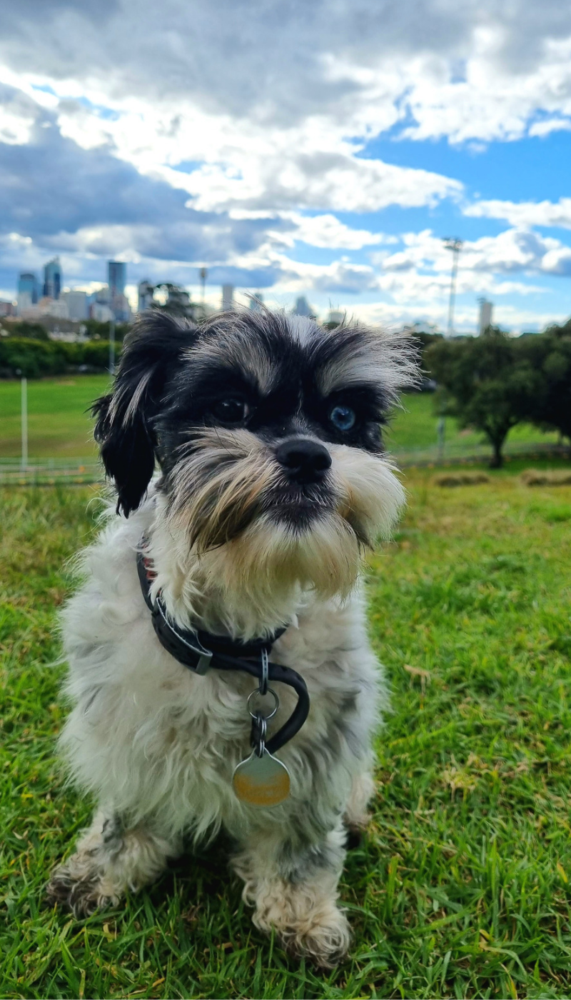

PhotoMosaic - Canva interview challenge for Android Software Engineer (late 2017)
------------

This is my original solution to a PhotoMosaic problem updated only to compile on latest versions of Android (mid 2022). This solution allowed me to progress to the final interview stage of Android Engineer interview at Canva.

### Tech/patterns used:
- RxJava
- DI (Dependency Injection)
- MVP (Model View Presenter)

[Watch video explanation on YouTube](https://youtu.be/rpmPeFzEAEs)

### Screen recording of the solution

*Image description: User picks an image from their device's local storage, the app loads the processed image row by row with each row consisting of dots generated from the average color of each tile.*

### The image used in the example above (800x1400px)
